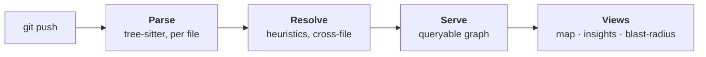
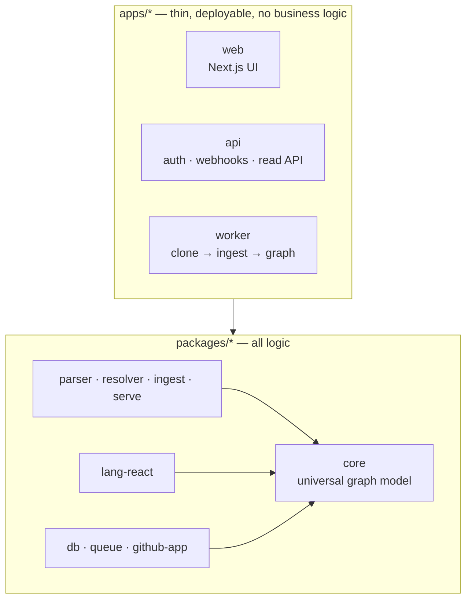

<div align="center">

<!--
  Brand assets are maintainer-supplied and not yet in the repo.
  Drop logo-light.svg / logo-dark.svg under .github/assets/ and the <picture>
  block below will render them. Until then it falls back to the wordmark text.
  Social preview (1280×640) is uploaded in GitHub → Settings → General → Social preview.
-->
<picture>
  <source media="(prefers-color-scheme: dark)" srcset=".github/assets/logo-dark.svg">
  <source media="(prefers-color-scheme: light)" srcset=".github/assets/logo-light.svg">
  
</picture>

# Toopo

**See your whole codebase as a zoomable graph — deterministic, self-hostable, updated every push, so you and your AI never code blind.**

<!-- The "Latest Release" and Discord badges are added at the first git tag (a deploy-time step). -->
[](https://github.com/toopo-io/toopo/actions/workflows/ci.yml)
[](./LICENSE)

Self-host with Docker Compose in 5 minutes.

</div>

---



<!--
  DEMO: record a short GIF of the canvas (zoom package → file → symbol, open an
  Insight, follow a blast-radius) and drop it here:
  
-->

## What Toopo does

- **Turns every push into a queryable graph** of symbols, dependencies, and usages — incrementally, re-parsing only the files that changed.
- **Zooms from package down to a single call-site** without ever re-parsing — one detailed graph, every zoom level a view derived on read.
- **Surfaces name collisions, unused symbols, and recursive cycles** — and always tells you which findings it can *prove* and which are only *candidates*.

## Why trust it

Toopo marks a symbol unused only when it can prove it: zero incoming usage edges across the graph, **and** no unresolved reference in its honest tail could reach it. If anything could, the symbol stays a **candidate** — never "dead." A name collision is a parse fact, so it is always certain; a dependency cycle is certain only when every edge in it is statically resolved, otherwise it too is a candidate.

Every edge is tagged `deterministic` or `inferred`, so certain and uncertain are distinguishable in the data and in the UI. The deterministic layer contains **no AI**, and the same commit always produces a **byte-identical** graph. One false positive destroys trust — Toopo would rather miss a real issue than cry a false one.

## Self-host in 5 minutes

```bash
cp .env.example .env
# Set the one required secret (min 32 chars):
#   openssl rand -base64 32   →   paste into BETTER_AUTH_SECRET in .env
docker compose up --build
```

Then open <http://localhost:3000>, sign up, and you're in. One command brings up the web UI, the API, the ingest worker, and a database (SQLite by default). Full guide, including the Postgres option and real-URL deployment: **[Self-host with Docker Compose](docs/getting-started/self-host.md)**.

## Features

Toopo is built deterministic-first. Everything below the line is shipped and works today; the *Planned* column is the AI layer and the languages still to come — listed so the line between them is never blurred.

| | Feature | Status |
| --- | --- | --- |
| 🗺️ | Deterministic code graph — same commit, byte-identical output | **Live** |
| ⚛️ | React + TypeScript (`.ts`, `.tsx`) | **Live** |
| 🔍 | Zoomable map: package → file → symbol → call-site (derived views, no re-parse) | **Live** |
| 🔗 | Node detail, neighbours (callers/callees), and declared interface | **Live** |
| 💥 | Blast radius — who depends on this, with per-hit *proven vs inferred* trust | **Live** |
| 📊 | Insights: name collisions, unused symbols, recursive cycles — each certain or candidate | **Live** |
| 🧩 | Call-site payloads — which props component A passes to component B | **Live** |
| 🔌 | Connect a repo via a GitHub App; delta-only ingestion on every push | **Live** |
| 👥 | Workspaces, projects, and membership-scoped graph access | **Live** |
| 🐳 | Self-host: Docker Compose, SQLite default or Postgres overlay | **Live** |
| 🤖 | Scoped AI analysis — traverse the graph instead of feeding a repo to an LLM | *Planned* |
| 📋 | Findings as kanban cards → a PR you review (never auto-merged) | *Planned* |
| 🌐 | More languages: JavaScript, Vue, Angular, Svelte, Python | *Planned* |

## Architecture

Three layers, strict one-way boundaries (machine-enforced — `pnpm boundaries`):



The pipeline is **Parse → Resolve → Serve** (see the diagram up top). Adding a language is a new `lang-*` package with zero change to `core` or the pipeline. The decisions behind all of this are recorded as ADRs — start with the **[architecture overview](docs/architecture/overview.md)** and the **[decision records](docs/adr/README.md)**.

## Quick start (development)

Prerequisites: Node.js 22 and pnpm 11.

```bash
pnpm install
pnpm build
pnpm dev
```

A change is done only when all six verification gates pass — typecheck, Biome, Vitest (≥80% on new code), build, `pnpm boundaries`, and a Conventional Commit. See **[Development setup](docs/contributing/development-setup.md)** and **[Verification gates](docs/contributing/verification-gates.md)**. A full root `CONTRIBUTING.md` is on the way.

## License

[GNU AGPL-3.0-or-later](./LICENSE) © 2026 Mathis Perron

Toopo is genuine OSI open source — free to use, self-host, study, and modify. The network-copyleft clause (AGPL §13) means anyone who offers a modified Toopo as a network service must release their changes under the same license. The copyright holder retains the right to grant separate commercial licenses. See [ADR-0019](docs/adr/0019-licensing.md) for the rationale.
