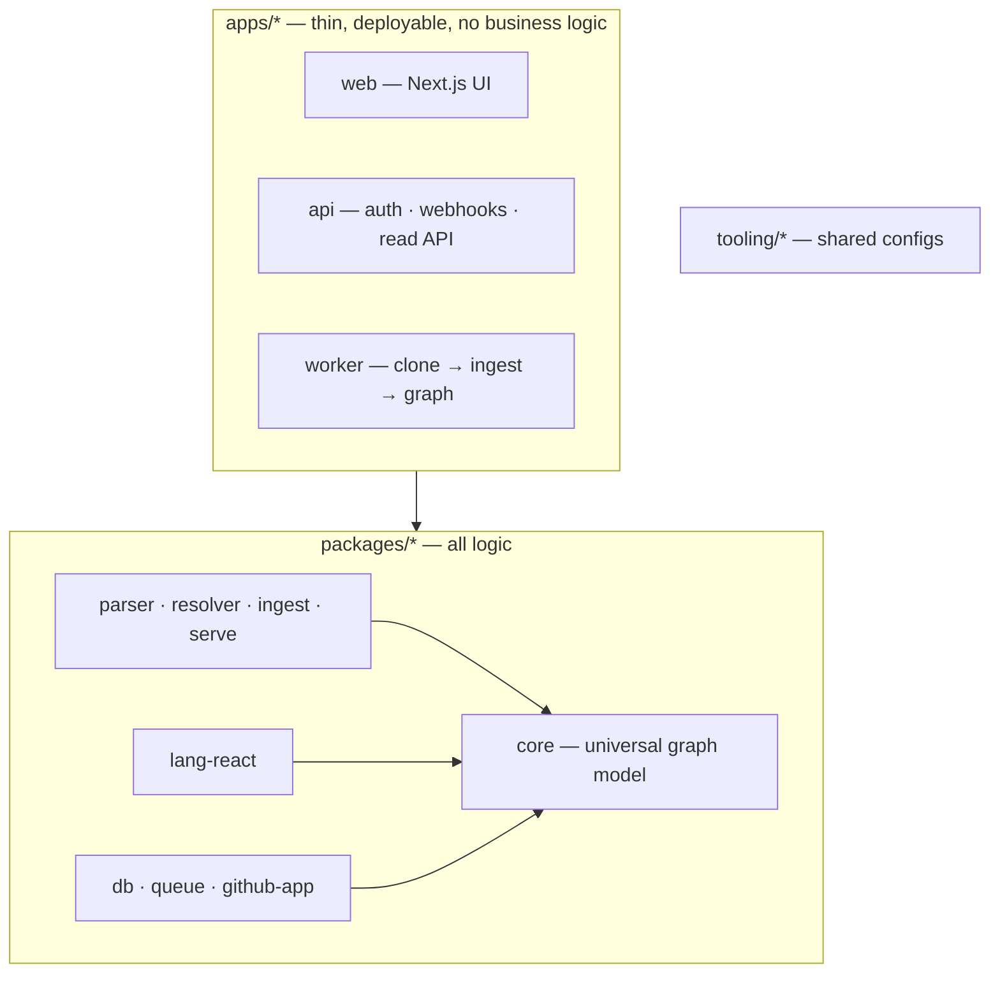

# Architecture overview

Toopo is a monorepo with three layers and strict, one-way boundaries between them. The boundaries are not a convention — they are machine-enforced by `pnpm boundaries` (dependency-cruiser plus a manifest check).

## Three layers

- **`apps/*`** are thin and deployable, with no business logic: `web` is the Next.js UI, `api` is the NestJS read API plus auth, webhooks, and orchestration, and `worker` clones and ingests repositories.
- **`packages/*`** hold all the logic. `core` is a flat base — the universal graph model and types — that every other package depends on directly; it is dependency-light (zero bundled runtime dependencies, `zod` as a peer only).
- **`tooling/*`** are shared, centralised configs.

The rules are hard: dependencies flow one way (apps → packages, never the reverse), there are no runtime cycles, and `core` imports no other workspace package. The web app reaches only the contract and presentation packages, never the engine tier.

## The pipeline

The engine turns a repository into a graph in three passes — **Parse → Resolve → Serve** — described in [how the graph works](../concepts/how-the-graph-works.md). Adding a language is a new `lang-*` package behind the language interface, with zero change to `core` or the pipeline.

## The packages

| Package | Role |
| --- | --- |
| `core` | The universal graph model and types ([ADR-0015](../adr/0015-universal-code-graph-model.md)). |
| `parser` | tree-sitter orchestration (Parse). |
| `resolver` | Cross-file semantic resolution (Resolve). |
| `lang-react` | React/TypeScript rules — the first language. |
| `ingest` | The Parse → Resolve pipeline driver. |
| `serve` | Derived read views and composition over the graph, including the Insights ([ADR-0020](../adr/0020-serve-pass-architecture.md), [ADR-0029](../adr/0029-deterministic-global-derived-views.md)). |
| `db` | Dual-backend persistence (SQLite / Postgres) via Kysely, plus the read primitives ([ADR-0017](../adr/0017-storage-strategy.md)). |
| `queue` | The job-queue abstraction and reliability driver ([ADR-0023](../adr/0023-job-queue-strategy.md)). |
| `github-app` | The GitHub-App auth seam ([ADR-0026](../adr/0026-github-app-connect-and-installation-auth.md)). |
| `api-contracts`, `env`, `i18n`, `ui` | Shared plumbing. |

The AI analysis packages (`analysis`, `ai-router`) are **planned**, not yet present.

---

**See also:** [Why Toopo](why-toopo.md) · [Decision records](../adr/README.md) · [How the graph works](../concepts/how-the-graph-works.md).
