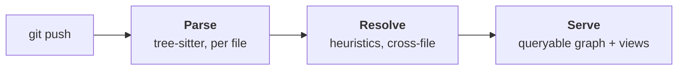

# How the graph works

## The problem

Understanding a codebase means answering questions across files: *what calls this? what does this component expect? if I change this, what breaks? is this symbol still used?* Asking a language model those questions means feeding it a whole repository — expensive, slow, and blind to anything outside the window it was given.

Toopo answers them from a graph instead. It parses the repository once into a structured graph of symbols, dependencies, and usages, then answers questions by traversing the graph — cheaply, deterministically, and at any zoom level. The same graph is what a scoped AI analysis will later traverse instead of re-reading the repository (that layer is [planned](what-toopo-cannot-do.md), not yet shipped).

## The pipeline

A push runs through three passes:

- **Parse** — per file, with [tree-sitter](https://tree-sitter.github.io/tree-sitter/) (run as WebAssembly via `web-tree-sitter`). Each file becomes its local facts: the symbols it declares, the call-sites inside them with their arguments, and each symbol's declared interface (parameters and props). Parse is a pure function of the file's bytes.
- **Resolve** — cross-file binding, batched per language. A custom heuristic resolver links imports and references across files: direct imports, barrel `index.ts` re-exports, namespace imports, and `tsconfig` path aliases. It targets robustly resolving the dominant real-world import shapes — not theoretical perfection — and makes everything it cannot resolve explicit instead of guessing.
- **Serve** — the queryable graph and the views derived from it on read: the zoomable map, node detail, neighbours, blast radius, and the [Insights](../guides/insights.md). Reverse indexes (who-calls-X) are built here, never stored in the canonical graph.

Only changed files are re-parsed: each file carries a content hash, and a push re-parses a file only when its hash changed. (See [ADR-0016](../adr/0016-parsing-and-resolution-strategy.md) and [ADR-0025](../adr/0025-worker-ingest-clone-and-incremental-persist.md).)

## The deterministic guarantee

The same commit always produces a **byte-identical** deterministic graph. This is what makes the content-hash cache and delta-only updates correct, and it is enforced by stable ordering: nodes and edges are ordered by logical identity, and the global views sort their output (collision order, cycle id, member order) so the result never depends on the order files were parsed in. These orderings are pinned by tests.

The deterministic layer — Parse and Resolve — contains **no AI** and no nondeterministic ordering. Every edge is tagged `deterministic` or `inferred` (see [the graph model](graph-model.md)); the two are never merged, in the data or in the UI.

## What it does not pretend to know

The resolver is heuristic, not compiler-grade. When it cannot bind a reference — a dynamically chosen component, a member access whose root it cannot type — it does **not** invent an edge. Fabricating an edge would assert a dependency Toopo cannot prove, and that is exactly the false confidence the trust principle forbids. Instead, the unresolved reference is recorded in a persisted, honest *tail* alongside the graph. That tail is what keeps later views truthful: the [unused-symbol view](../guides/insights.md) consults it so a resolution gap is never mistaken for genuine absence. See [what Toopo cannot do](what-toopo-cannot-do.md) for the full boundary.

## Why tree-sitter, not LSP or stack-graphs

Two alternatives were considered and rejected ([ADR-0016](../adr/0016-parsing-and-resolution-strategy.md)):

- **GitHub stack-graphs** require per-language resolution authored in a graph-construction DSL — costly to write, hard to verify against language semantics, and a blocker to extending across many languages.
- **LSP-based resolution** is slow and unreliable for batch, whole-repo, multi-language analysis, and couples Toopo to per-language language servers and their lifecycles.

tree-sitter parses every file into a concrete syntax tree with error-tolerant, S-expression queries; running it as a single `.wasm` per grammar means zero native build, identical behaviour on every platform, and trivial self-hosting. The constant-factor slowdown versus native bindings is immaterial for per-push parsing.

---

**See also:** [The graph model](graph-model.md) · [What Toopo cannot do](what-toopo-cannot-do.md) · [ADR-0015](../adr/0015-universal-code-graph-model.md) (the model) · [ADR-0016](../adr/0016-parsing-and-resolution-strategy.md) (parse & resolve).
